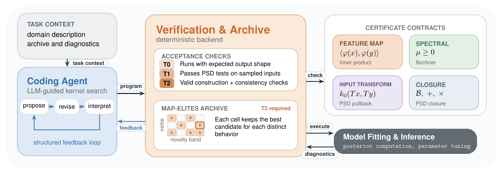
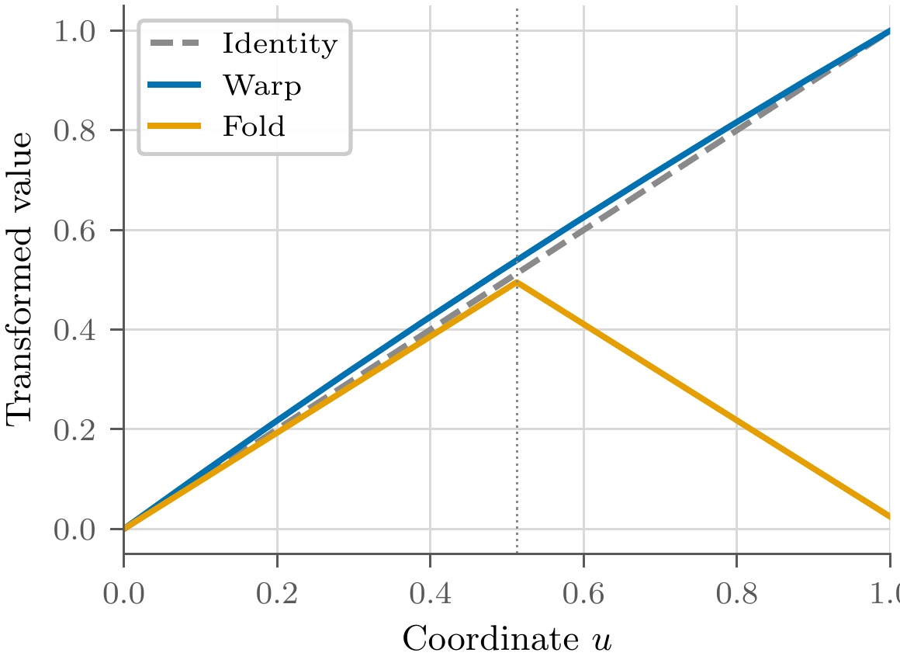
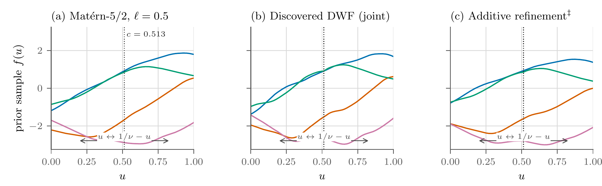

# How Kernaut works

{ style="width:100%" }

Kernaut searches for reusable kernels through four steps:

1. **Propose.** A coding agent writes kernel components, such as feature maps or input transforms.
2. **Verify.** A trusted backend assembles the components using construction rules that preserve kernel validity under stated assumptions.
3. **Evaluate and refine.** The system scores candidates and keeps strong kernels with distinct behaviors in an archive. Agents use these results to guide further proposals.
4. **Test transfer.** Validation selects a frozen kernel, which is then evaluated on tasks the search never saw.

Read the [verification guide](verification.md) for construction contracts and checks, and the [meta-evaluation protocol](meta-evaluation.md) for task splits and candidate selection.

## Example discovery: the DWF kernel

An agent discovered the **dual warp-fold (DWF)** kernel on the black-box optimization benchmark.
DWF combines a gentle warp with a triangular fold of each input coordinate. The fold maps mirrored inputs to the same feature value, while the warp keeps them distinguishable.

{ style="width:55%; display:block; margin:0 auto" }

*The gentle warp and triangular fold used by DWF.*

DWF applies a Matérn-5/2 kernel to this discovered representation, so similarity depends on input location as well as distance. This makes it nonstationary, unlike a standard Matérn kernel. Sums and products of standard stationary kernels cannot recover this structure.

Because the discovered kernel programs are short and interpretable, they invite human–AI collaboration: researchers can understand the agent's proposal and refine its assumptions. For DWF, we separated the warp and fold into additive kernel components, strengthening the connection between mirrored inputs. This human-refined version reduced held-out predictive error by a further 5.7%, showing how an agent's discovery can become a starting point for further model design.

{ style="width:100%" }

*Functions sampled before fitting data: (a) Matérn-5/2 and (b) DWF. DWF samples have visible corners at the fold.*

Try the [black-box optimization benchmark](tasks.md#black-box-optimization), or read the [paper](https://www.alphaxiv.org/abs/2610.kernel-autoresearch) for the full analysis.
